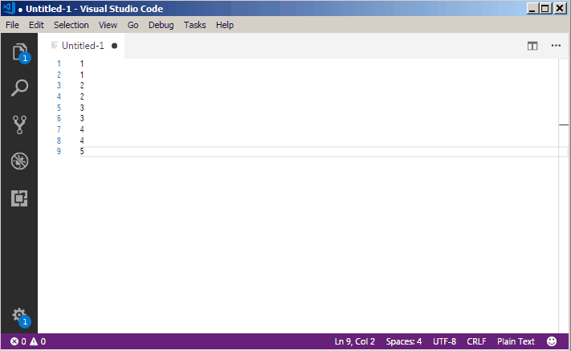

# Permute Lines

This extension brings to Visual Studio Code the following line operations:

- Permute Lines: Reverse
- Permute Lines: Shuffle
- Permute Lines: Unique

If you are acquainted with Sublime Text, this list may look familiar, because it is actually the list of commands available in Sublime Text under "Edit > Permute Lines".

